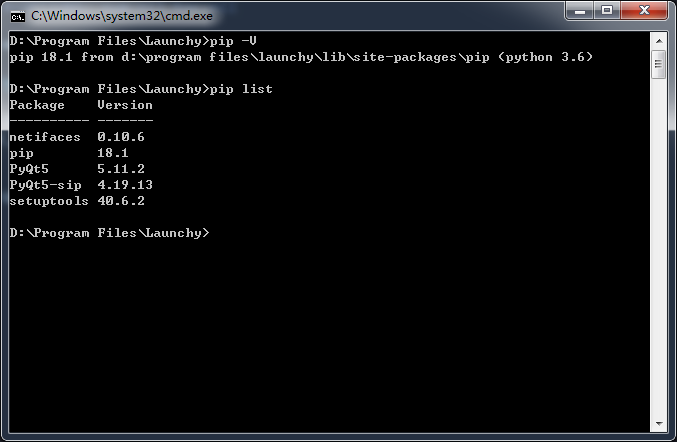

=================
Develop in Python
=================

Plugin Template
---------------

Here is a python plugin template, you can use it as a starter kit.

`https://github.com/samsonwang/LaunchyQt/tree/master/plugin_demo/DemoPy <https://github.com/samsonwang/LaunchyQt/tree/master/plugin_demo/DemoPy>`_

If you need extra lanchy interface exposed to python, feel free to contact me.

Manage python packages by pip
-----------------------------

1. Input ``lpip`` in launchy search box, and press ``enter`` (actually we are executing a script named ``lpip.cmd`` )

2. There will be a command line ( ``cmd`` ) window, and you can use pip now

