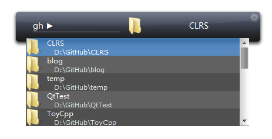
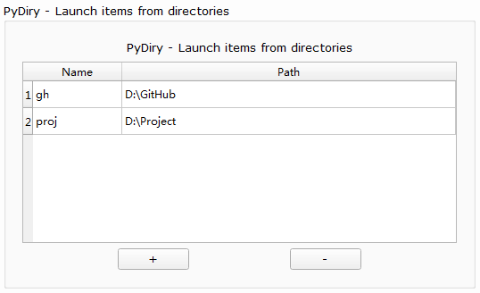

========
PyDiryPy
========

PyDiryPy is very useful in browsing and launching items from frequent directory.

Just input directory name key and press ``tab``, and you will get items from the directory.

Directory key is customizable from option dialog.

