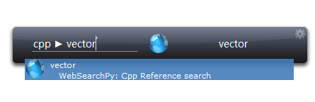
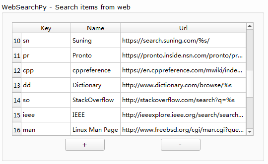

===========
WebSearchPy
===========

WebSearchPy allows you to search the web quickly.

The search engine and keywords is customizable in option dialog.

**Take cppreference as an example.**

The ``Key`` is what you can put in search box to indicate a web search. Once you have input ``cpp`` (make sure the WebSearchPy item is focused), press ``tab`` and then input what you want to search (this time I want to search ``vector`` ) and press ``Enter`` . Your default web browser should open and do the search.

The ``Url`` is the template to make a search link.

Here is the cppreference search link: ``https://en.cppreference.com/mwiki/index.php?title=Special%%3ASearch&search=%s``

Pay attention to the ``%s``, this would be replaced by your search content.
